# Telegram Animals
## About
Telegram platforms have a quite nice feature as anonymous users or admins. For instance, you can't see real names and avatars of admins on bugs.telegram.org, instead you see some random animal and also randomly generated name. I decided to get all of these animals and share with people. I converted them to .svg and .png files (you can find them in ./src directory) and everyone can download them freely.

## All animals
<table>
    <tr>
        <th>Name</th>
        <th>Preview</th>
        <th>Download</th>
    </tr>
<tr><th>Ant</th><th>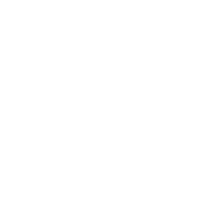</th><th><a href="./src/svg/ant.svg">SVG</a> <a href="./src/png/ant.png">PNG</a></th></tr>

<tr><th>Antelope</th><th>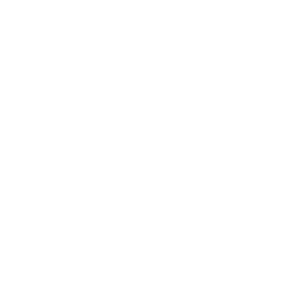</th><th><a href="./src/svg/antelope.svg">SVG</a> <a href="./src/png/antelope.png">PNG</a></th></tr>

<tr><th>Bass</th><th>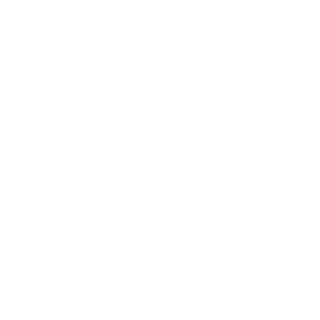</th><th><a href="./src/svg/bass.svg">SVG</a> <a href="./src/png/bass.png">PNG</a></th></tr>

<tr><th>Bat</th><th>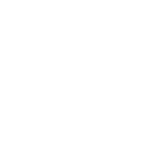</th><th><a href="./src/svg/bat.svg">SVG</a> <a href="./src/png/bat.png">PNG</a></th></tr>

<tr><th>Bear</th><th>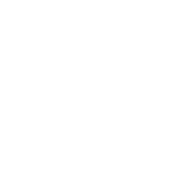</th><th><a href="./src/svg/bear.svg">SVG</a> <a href="./src/png/bear.png">PNG</a></th></tr>

<tr><th>Beaver</th><th></th><th><a href="./src/svg/beaver.svg">SVG</a> <a href="./src/png/beaver.png">PNG</a></th></tr>

<tr><th>Bee</th><th>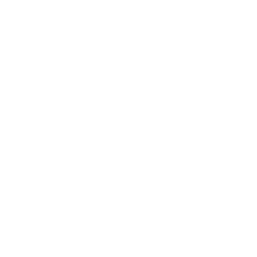</th><th><a href="./src/svg/bee.svg">SVG</a> <a href="./src/png/bee.png">PNG</a></th></tr>

<tr><th>Beetle</th><th>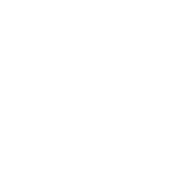</th><th><a href="./src/svg/beetle.svg">SVG</a> <a href="./src/png/beetle.png">PNG</a></th></tr>

<tr><th>Boar</th><th></th><th><a href="./src/svg/boar.svg">SVG</a> <a href="./src/png/boar.png">PNG</a></th></tr>

<tr><th>Bull</th><th></th><th><a href="./src/svg/bull.svg">SVG</a> <a href="./src/png/bull.png">PNG</a></th></tr>

<tr><th>Butterfly</th><th>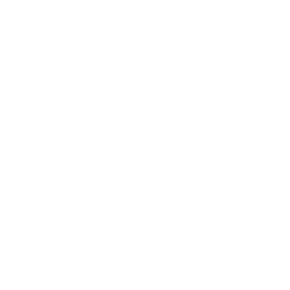</th><th><a href="./src/svg/butterfly.svg">SVG</a> <a href="./src/png/butterfly.png">PNG</a></th></tr>

<tr><th>Camel</th><th>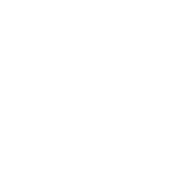</th><th><a href="./src/svg/camel.svg">SVG</a> <a href="./src/png/camel.png">PNG</a></th></tr>

<tr><th>Cat</th><th>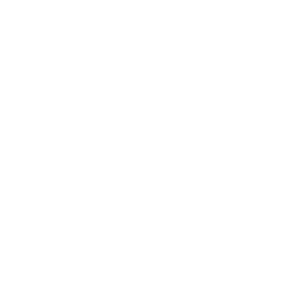</th><th><a href="./src/svg/cat.svg">SVG</a> <a href="./src/png/cat.png">PNG</a></th></tr>

<tr><th>Chameleon</th><th>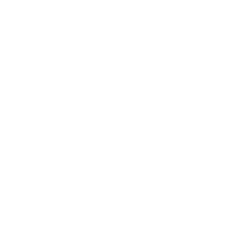</th><th><a href="./src/svg/chameleon.svg">SVG</a> <a href="./src/png/chameleon.png">PNG</a></th></tr>

<tr><th>Chicken</th><th>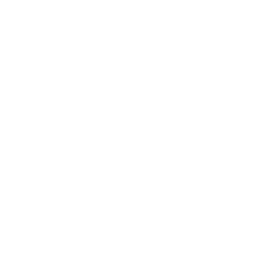</th><th><a href="./src/svg/chicken.svg">SVG</a> <a href="./src/png/chicken.png">PNG</a></th></tr>

<tr><th>Clam</th><th>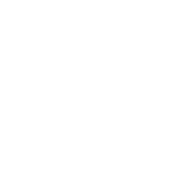</th><th><a href="./src/svg/clam.svg">SVG</a> <a href="./src/png/clam.png">PNG</a></th></tr>

<tr><th>Cobra</th><th></th><th><a href="./src/svg/cobra.svg">SVG</a> <a href="./src/png/cobra.png">PNG</a></th></tr>

<tr><th>Cock</th><th>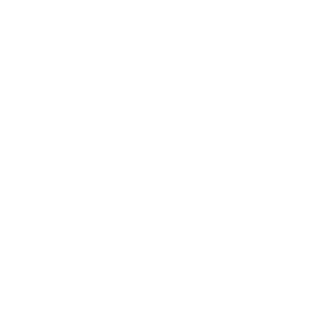</th><th><a href="./src/svg/cock.svg">SVG</a> <a href="./src/png/cock.png">PNG</a></th></tr>

<tr><th>Cockroach</th><th>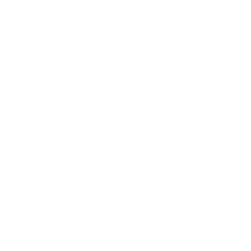</th><th><a href="./src/svg/cockroach.svg">SVG</a> <a href="./src/png/cockroach.png">PNG</a></th></tr>

<tr><th>Cow</th><th>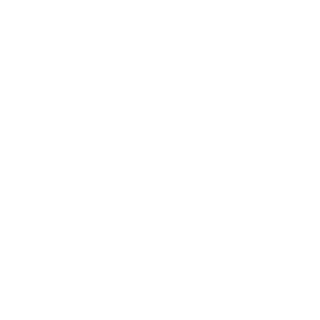</th><th><a href="./src/svg/cow.svg">SVG</a> <a href="./src/png/cow.png">PNG</a></th></tr>

<tr><th>Crab</th><th>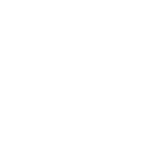</th><th><a href="./src/svg/crab.svg">SVG</a> <a href="./src/png/crab.png">PNG</a></th></tr>

<tr><th>Croc</th><th>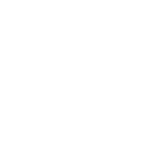</th><th><a href="./src/svg/croc.svg">SVG</a> <a href="./src/png/croc.png">PNG</a></th></tr>

<tr><th>Crow</th><th>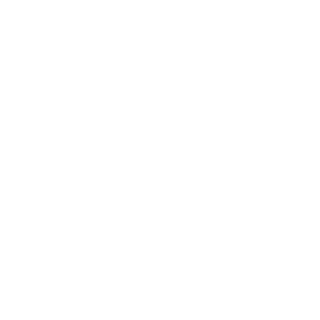</th><th><a href="./src/svg/crow.svg">SVG</a> <a href="./src/png/crow.png">PNG</a></th></tr>

<tr><th>Deer</th><th>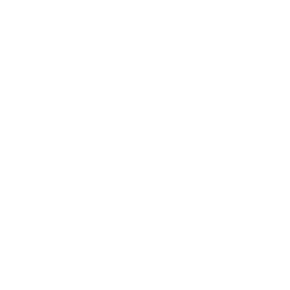</th><th><a href="./src/svg/deer.svg">SVG</a> <a href="./src/png/deer.png">PNG</a></th></tr>

<tr><th>Dodo</th><th>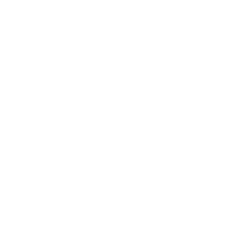</th><th><a href="./src/svg/dodo.svg">SVG</a> <a href="./src/png/dodo.png">PNG</a></th></tr>

<tr><th>Dog</th><th>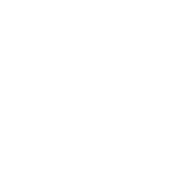</th><th><a href="./src/svg/dog.svg">SVG</a> <a href="./src/png/dog.png">PNG</a></th></tr>

<tr><th>Dolphin</th><th>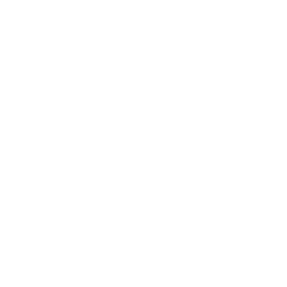</th><th><a href="./src/svg/dolphin.svg">SVG</a> <a href="./src/png/dolphin.png">PNG</a></th></tr>

<tr><th>Dragon</th><th>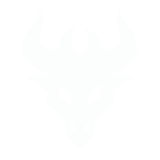</th><th><a href="./src/svg/dragon.svg">SVG</a> <a href="./src/png/dragon.png">PNG</a></th></tr>

<tr><th>Duck</th><th>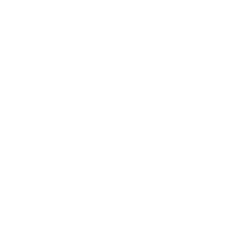</th><th><a href="./src/svg/duck.svg">SVG</a> <a href="./src/png/duck.png">PNG</a></th></tr>

<tr><th>Eagle</th><th></th><th><a href="./src/svg/eagle.svg">SVG</a> <a href="./src/png/eagle.png">PNG</a></th></tr>

<tr><th>Elk</th><th>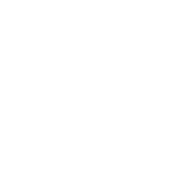</th><th><a href="./src/svg/elk.svg">SVG</a> <a href="./src/png/elk.png">PNG</a></th></tr>

<tr><th>Falcon</th><th>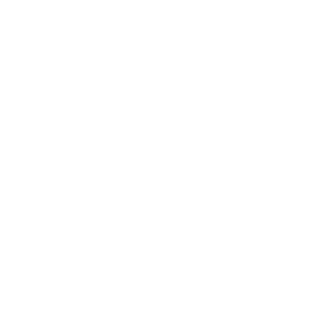</th><th><a href="./src/svg/falcon.svg">SVG</a> <a href="./src/png/falcon.png">PNG</a></th></tr>

<tr><th>Fish</th><th>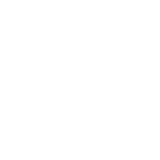</th><th><a href="./src/svg/fish.svg">SVG</a> <a href="./src/png/fish.png">PNG</a></th></tr>

<tr><th>Flamingo</th><th>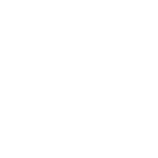</th><th><a href="./src/svg/flamingo.svg">SVG</a> <a href="./src/png/flamingo.png">PNG</a></th></tr>

<tr><th>Fly</th><th>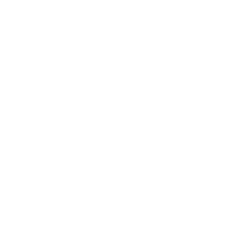</th><th><a href="./src/svg/fly.svg">SVG</a> <a href="./src/png/fly.png">PNG</a></th></tr>

<tr><th>Fox</th><th>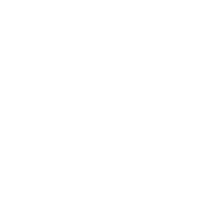</th><th><a href="./src/svg/fox.svg">SVG</a> <a href="./src/png/fox.png">PNG</a></th></tr>

<tr><th>Frog</th><th>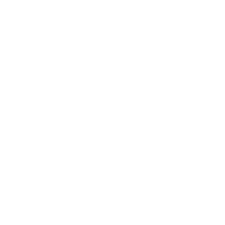</th><th><a href="./src/svg/frog.svg">SVG</a> <a href="./src/png/frog.png">PNG</a></th></tr>

<tr><th>Gecko</th><th>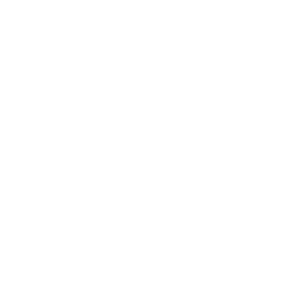</th><th><a href="./src/svg/gecko.svg">SVG</a> <a href="./src/png/gecko.png">PNG</a></th></tr>

<tr><th>Giraffe</th><th>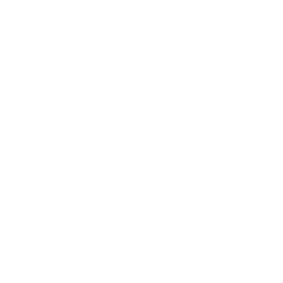</th><th><a href="./src/svg/giraffe.svg">SVG</a> <a href="./src/png/giraffe.png">PNG</a></th></tr>

<tr><th>Gnat</th><th>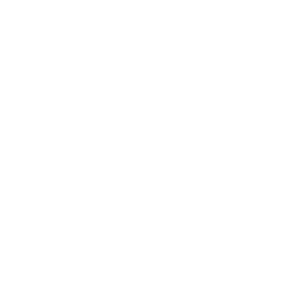</th><th><a href="./src/svg/gnat.svg">SVG</a> <a href="./src/png/gnat.png">PNG</a></th></tr>

<tr><th>Gnu</th><th>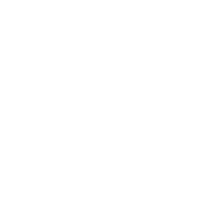</th><th><a href="./src/svg/gnu.svg">SVG</a> <a href="./src/png/gnu.png">PNG</a></th></tr>

<tr><th>Goat</th><th>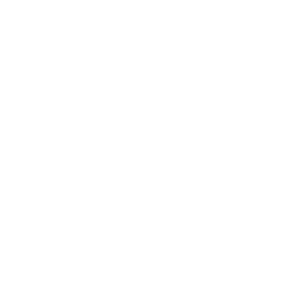</th><th><a href="./src/svg/goat.svg">SVG</a> <a href="./src/png/goat.png">PNG</a></th></tr>

<tr><th>Goose</th><th>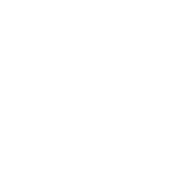</th><th><a href="./src/svg/goose.svg">SVG</a> <a href="./src/png/goose.png">PNG</a></th></tr>

<tr><th>Gopher</th><th>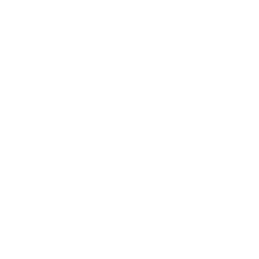</th><th><a href="./src/svg/gopher.svg">SVG</a> <a href="./src/png/gopher.png">PNG</a></th></tr>

<tr><th>Gorilla</th><th></th><th><a href="./src/svg/gorilla.svg">SVG</a> <a href="./src/png/gorilla.png">PNG</a></th></tr>

<tr><th>Griffin</th><th></th><th><a href="./src/svg/griffin.svg">SVG</a> <a href="./src/png/griffin.png">PNG</a></th></tr>

<tr><th>Gull</th><th>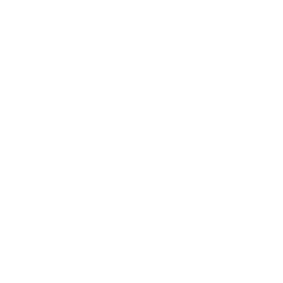</th><th><a href="./src/svg/gull.svg">SVG</a> <a href="./src/png/gull.png">PNG</a></th></tr>

<tr><th>Hamster</th><th></th><th><a href="./src/svg/hamster.svg">SVG</a> <a href="./src/png/hamster.png">PNG</a></th></tr>

<tr><th>Hare</th><th>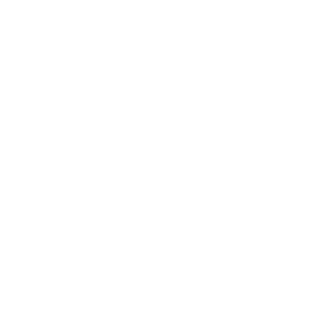</th><th><a href="./src/svg/hare.svg">SVG</a> <a href="./src/png/hare.png">PNG</a></th></tr>

<tr><th>Hawk</th><th>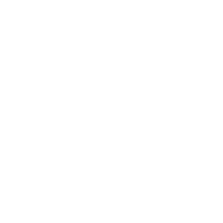</th><th><a href="./src/svg/hawk.svg">SVG</a> <a href="./src/png/hawk.png">PNG</a></th></tr>

<tr><th>Hedgehog</th><th>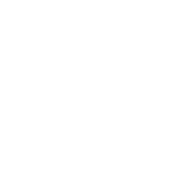</th><th><a href="./src/svg/hedgehog.svg">SVG</a> <a href="./src/png/hedgehog.png">PNG</a></th></tr>

<tr><th>Heron</th><th>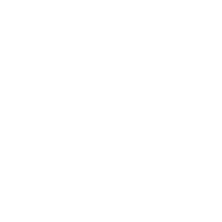</th><th><a href="./src/svg/heron.svg">SVG</a> <a href="./src/png/heron.png">PNG</a></th></tr>

<tr><th>Horse</th><th>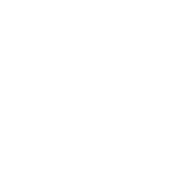</th><th><a href="./src/svg/horse.svg">SVG</a> <a href="./src/png/horse.png">PNG</a></th></tr>

<tr><th>Hyena</th><th>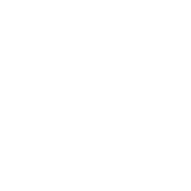</th><th><a href="./src/svg/hyena.svg">SVG</a> <a href="./src/png/hyena.png">PNG</a></th></tr>

<tr><th>Ibex</th><th>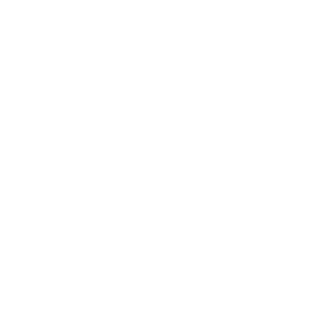</th><th><a href="./src/svg/ibex.svg">SVG</a> <a href="./src/png/ibex.png">PNG</a></th></tr>

<tr><th>Jackal</th><th>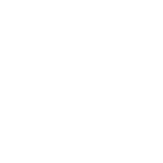</th><th><a href="./src/svg/jackal.svg">SVG</a> <a href="./src/png/jackal.png">PNG</a></th></tr>

<tr><th>Jaguar</th><th>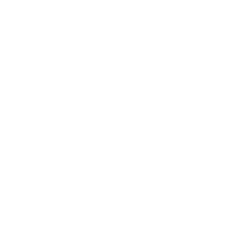</th><th><a href="./src/svg/jaguar.svg">SVG</a> <a href="./src/png/jaguar.png">PNG</a></th></tr>

<tr><th>Kangaroo</th><th>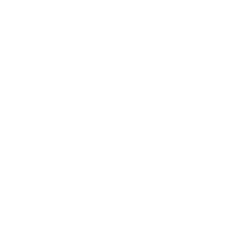</th><th><a href="./src/svg/kangaroo.svg">SVG</a> <a href="./src/png/kangaroo.png">PNG</a></th></tr>

<tr><th>Kitten</th><th></th><th><a href="./src/svg/kitten.svg">SVG</a> <a href="./src/png/kitten.png">PNG</a></th></tr>

<tr><th>Kiwi</th><th></th><th><a href="./src/svg/kiwi.svg">SVG</a> <a href="./src/png/kiwi.png">PNG</a></th></tr>

<tr><th>Ladybird</th><th></th><th><a href="./src/svg/ladybird.svg">SVG</a> <a href="./src/png/ladybird.png">PNG</a></th></tr>

<tr><th>Lemur</th><th></th><th><a href="./src/svg/lemur.svg">SVG</a> <a href="./src/png/lemur.png">PNG</a></th></tr>

<tr><th>Leopard</th><th></th><th><a href="./src/svg/leopard.svg">SVG</a> <a href="./src/png/leopard.png">PNG</a></th></tr>

<tr><th>Lion</th><th></th><th><a href="./src/svg/lion.svg">SVG</a> <a href="./src/png/lion.png">PNG</a></th></tr>

<tr><th>Lizard</th><th></th><th><a href="./src/svg/lizard.svg">SVG</a> <a href="./src/png/lizard.png">PNG</a></th></tr>

<tr><th>Llama</th><th></th><th><a href="./src/svg/llama.svg">SVG</a> <a href="./src/png/llama.png">PNG</a></th></tr>

<tr><th>Lynx</th><th></th><th><a href="./src/svg/lynx.svg">SVG</a> <a href="./src/png/lynx.png">PNG</a></th></tr>

<tr><th>Mammoth</th><th></th><th><a href="./src/svg/mammoth.svg">SVG</a> <a href="./src/png/mammoth.png">PNG</a></th></tr>

<tr><th>Mantis</th><th></th><th><a href="./src/svg/mantis.svg">SVG</a> <a href="./src/png/mantis.png">PNG</a></th></tr>

<tr><th>Meerkat</th><th></th><th><a href="./src/svg/meerkat.svg">SVG</a> <a href="./src/png/meerkat.png">PNG</a></th></tr>

<tr><th>Mink</th><th></th><th><a href="./src/svg/mink.svg">SVG</a> <a href="./src/png/mink.png">PNG</a></th></tr>

<tr><th>Monkey</th><th></th><th><a href="./src/svg/monkey.svg">SVG</a> <a href="./src/png/monkey.png">PNG</a></th></tr>

<tr><th>Moth</th><th></th><th><a href="./src/svg/moth.svg">SVG</a> <a href="./src/png/moth.png">PNG</a></th></tr>

<tr><th>Mule</th><th></th><th><a href="./src/svg/mule.svg">SVG</a> <a href="./src/png/mule.png">PNG</a></th></tr>

<tr><th>Otter</th><th></th><th><a href="./src/svg/otter.svg">SVG</a> <a href="./src/png/otter.png">PNG</a></th></tr>

<tr><th>Owl</th><th></th><th><a href="./src/svg/owl.svg">SVG</a> <a href="./src/png/owl.png">PNG</a></th></tr>

<tr><th>Panda</th><th></th><th><a href="./src/svg/panda.svg">SVG</a> <a href="./src/png/panda.png">PNG</a></th></tr>

<tr><th>Parrot</th><th></th><th><a href="./src/svg/parrot.svg">SVG</a> <a href="./src/png/parrot.png">PNG</a></th></tr>

<tr><th>Peacock</th><th></th><th><a href="./src/svg/peacock.svg">SVG</a> <a href="./src/png/peacock.png">PNG</a></th></tr>

<tr><th>Penguin</th><th></th><th><a href="./src/svg/penguin.svg">SVG</a> <a href="./src/png/penguin.png">PNG</a></th></tr>

<tr><th>Phoenix</th><th></th><th><a href="./src/svg/phoenix.svg">SVG</a> <a href="./src/png/phoenix.png">PNG</a></th></tr>

<tr><th>Pigeon</th><th></th><th><a href="./src/svg/pigeon.svg">SVG</a> <a href="./src/png/pigeon.png">PNG</a></th></tr>

<tr><th>Piranha</th><th></th><th><a href="./src/svg/piranha.svg">SVG</a> <a href="./src/png/piranha.png">PNG</a></th></tr>

<tr><th>Pony</th><th></th><th><a href="./src/svg/pony.svg">SVG</a> <a href="./src/png/pony.png">PNG</a></th></tr>

<tr><th>Puffin</th><th></th><th><a href="./src/svg/puffin.svg">SVG</a> <a href="./src/png/puffin.png">PNG</a></th></tr>

<tr><th>Pug</th><th></th><th><a href="./src/svg/pug.svg">SVG</a> <a href="./src/png/pug.png">PNG</a></th></tr>

<tr><th>Puma</th><th></th><th><a href="./src/svg/puma.svg">SVG</a> <a href="./src/png/puma.png">PNG</a></th></tr>

<tr><th>Python</th><th></th><th><a href="./src/svg/python.svg">SVG</a> <a href="./src/png/python.png">PNG</a></th></tr>

<tr><th>Quokka</th><th></th><th><a href="./src/svg/quokka.svg">SVG</a> <a href="./src/png/quokka.png">PNG</a></th></tr>

<tr><th>Rabbit</th><th></th><th><a href="./src/svg/rabbit.svg">SVG</a> <a href="./src/png/rabbit.png">PNG</a></th></tr>

<tr><th>Raccoon</th><th></th><th><a href="./src/svg/raccoon.svg">SVG</a> <a href="./src/png/raccoon.png">PNG</a></th></tr>

<tr><th>Ram</th><th></th><th><a href="./src/svg/ram.svg">SVG</a> <a href="./src/png/ram.png">PNG</a></th></tr>

<tr><th>Rat</th><th></th><th><a href="./src/svg/rat.svg">SVG</a> <a href="./src/png/rat.png">PNG</a></th></tr>

<tr><th>Raven</th><th></th><th><a href="./src/svg/raven.svg">SVG</a> <a href="./src/png/raven.png">PNG</a></th></tr>

<tr><th>Rhino</th><th></th><th><a href="./src/svg/rhino.svg">SVG</a> <a href="./src/png/rhino.png">PNG</a></th></tr>

<tr><th>Scorpion</th><th></th><th><a href="./src/svg/scorpion.svg">SVG</a> <a href="./src/png/scorpion.png">PNG</a></th></tr>

<tr><th>Seal</th><th></th><th><a href="./src/svg/seal.svg">SVG</a> <a href="./src/png/seal.png">PNG</a></th></tr>

<tr><th>Shark</th><th></th><th><a href="./src/svg/shark.svg">SVG</a> <a href="./src/png/shark.png">PNG</a></th></tr>

<tr><th>Sheep</th><th></th><th><a href="./src/svg/sheep.svg">SVG</a> <a href="./src/png/sheep.png">PNG</a></th></tr>

<tr><th>Shrimp</th><th></th><th><a href="./src/svg/shrimp.svg">SVG</a> <a href="./src/png/shrimp.png">PNG</a></th></tr>

<tr><th>Skunk</th><th></th><th><a href="./src/svg/skunk.svg">SVG</a> <a href="./src/png/skunk.png">PNG</a></th></tr>

<tr><th>Sloth</th><th></th><th><a href="./src/svg/sloth.svg">SVG</a> <a href="./src/png/sloth.png">PNG</a></th></tr>

<tr><th>Snail</th><th></th><th><a href="./src/svg/snail.svg">SVG</a> <a href="./src/png/snail.png">PNG</a></th></tr>

<tr><th>Spider</th><th></th><th><a href="./src/svg/spider.svg">SVG</a> <a href="./src/png/spider.png">PNG</a></th></tr>

<tr><th>Squid</th><th></th><th><a href="./src/svg/squid.svg">SVG</a> <a href="./src/png/squid.png">PNG</a></th></tr>

<tr><th>Squirrel</th><th></th><th><a href="./src/svg/squirrel.svg">SVG</a> <a href="./src/png/squirrel.png">PNG</a></th></tr>

<tr><th>Starfish</th><th></th><th><a href="./src/svg/starfish.svg">SVG</a> <a href="./src/png/starfish.png">PNG</a></th></tr>

<tr><th>Swallow</th><th></th><th><a href="./src/svg/swallow.svg">SVG</a> <a href="./src/png/swallow.png">PNG</a></th></tr>

<tr><th>Swan</th><th></th><th><a href="./src/svg/swan.svg">SVG</a> <a href="./src/png/swan.png">PNG</a></th></tr>

<tr><th>Tapir</th><th></th><th><a href="./src/svg/tapir.svg">SVG</a> <a href="./src/png/tapir.png">PNG</a></th></tr>

<tr><th>Tiger</th><th></th><th><a href="./src/svg/tiger.svg">SVG</a> <a href="./src/png/tiger.png">PNG</a></th></tr>

<tr><th>Toad</th><th></th><th><a href="./src/svg/toad.svg">SVG</a> <a href="./src/png/toad.png">PNG</a></th></tr>

<tr><th>Turkey</th><th></th><th><a href="./src/svg/turkey.svg">SVG</a> <a href="./src/png/turkey.png">PNG</a></th></tr>

<tr><th>Turtle</th><th></th><th><a href="./src/svg/turtle.svg">SVG</a> <a href="./src/png/turtle.png">PNG</a></th></tr>

<tr><th>Unicorn</th><th></th><th><a href="./src/svg/unicorn.svg">SVG</a> <a href="./src/png/unicorn.png">PNG</a></th></tr>

<tr><th>Walrus</th><th></th><th><a href="./src/svg/walrus.svg">SVG</a> <a href="./src/png/walrus.png">PNG</a></th></tr>

<tr><th>Wasp</th><th></th><th><a href="./src/svg/wasp.svg">SVG</a> <a href="./src/png/wasp.png">PNG</a></th></tr>

<tr><th>Whale</th><th></th><th><a href="./src/svg/whale.svg">SVG</a> <a href="./src/png/whale.png">PNG</a></th></tr>

<tr><th>Wolf</th><th></th><th><a href="./src/svg/wolf.svg">SVG</a> <a href="./src/png/wolf.png">PNG</a></th></tr>

<tr><th>Wombat</th><th></th><th><a href="./src/svg/wombat.svg">SVG</a> <a href="./src/png/wombat.png">PNG</a></th></tr>

<tr><th>Yak</th><th></th><th><a href="./src/svg/yak.svg">SVG</a> <a href="./src/png/yak.png">PNG</a></th></tr>

<tr><th>Zebra</th><th></th><th><a href="./src/svg/zebra.svg">SVG</a> <a href="./src/png/zebra.png">PNG</a></th></tr>
</table>